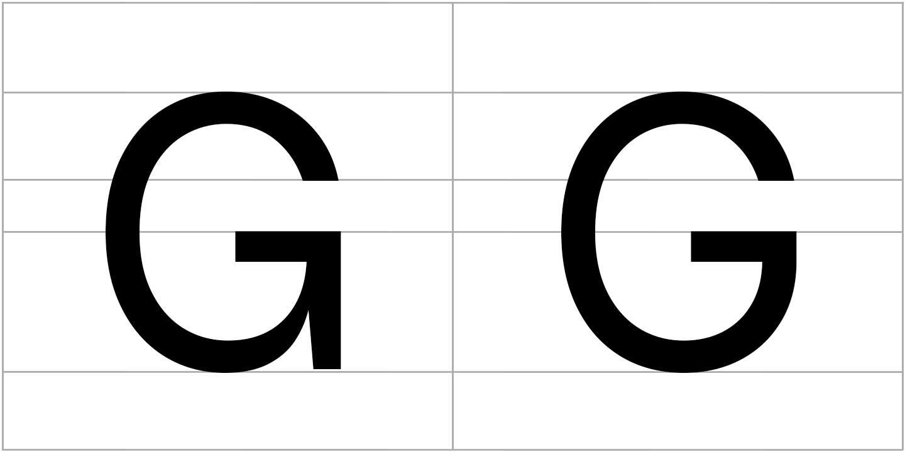

# Sarasa Ji Gothic（更纱圆纪黑体）

Sarasa Ji Gothic 是一款免费的开源字体，基于 [Sarasa Gothic](https://github.com/be5invis/Sarasa-Gothic/) 修改而来，基于 [Inter](https://github.com/rsms/inter) 和 [Source Han Sans](https://github.com/adobe-fonts/source-han-sans) 字型，适用于包含中日韩等多种亚洲语言之间混排的场景使用，主要用于网页开发，在 SIL 开源字体许可证下发布。

## 从何而来？

你是否希望你的网页在非 Apple 设备上也能显示优雅的 [San Francisco](https://developer.apple.com/fonts/) 字体？

显然，这是不可能的，因为 Apple 仅允许开发者在开发 Apple 平台应用程序时才可使用 San Francisco（当然，这无可厚非）。此时，能否寻找到一款无限接近与 San Francisco 的替代，决定了你能否实现这个看起来有些固执的想法。

Sarasa Gothic 是一个近乎完美的解决方法，除了大写字母 `G` ！Sarasa Gothic 在构建时启用了 Inter 的 `cv10` 可变字符选项，这使得其大写字母 `G` 并非像 San Francisco 那样圆润，这也是本项目诞生的原因。

是的，与原项目相比，Sarasa Ji Gothic 仅在大写字母 `G` 的字形上有所不同。为了得到一个更接近与 San Francisco 的视觉体验，我重新构建了 Sarasa Gothic ，并根据新字体的特点“更加圆润的大写字母 `G`”，取谐音将其命名为**更纱圆纪黑体**，英文命名为 Sarasa Ji Gothic，并按照原项目许可证要求进行开源。



如果你在网页开发过程中使用到了本字体，请不要吝啬您的慷慨，为本项目点亮 **star** ，并也请一并为原项目（[Sarasa Gothic](https://github.com/be5invis/Sarasa-Gothic/)）点亮 **star** ，不胜感激！

## 如何选择版本？

进入[最新发布版本](https://github.com/edgeworthlauzero/sarasa-ji-gothic/releases/latest)页面，根据需要下载对应系列的字体包，下载后解压并安装。

Sarasa Ji Gothic 仅提供 `ttf` 格式的两种风格的非等宽字型，如需 `ttc` 格式请自行构建，如需等宽字型请直接使用原项目（[Sarasa Gothic](https://github.com/be5invis/Sarasa-Gothic/)）。

### 字型风格

根据字型差异和实际需求来选择字体。

  - `Gothic` : 标准字型，全宽引号，非等宽数字。
  - `UI` : 专为 UI 界面设计的字型，半宽引号，等宽数字。

### 地区语言

根据特定语言和地区主要使用的字形来选择字体。

- `SC` : 简体中文
- `TC` : 中国台湾繁体中文
- `HC` : 中国香港繁体中文
- `CL` : 传统旧字形中文
- `J` : 日文
- `K` : 韩文

### 字体格式

根据使用场景和格式需求来选择字体。

- `TTF` : 已进行微调字形的 `ttf` 格式版本；适用于本地设备使用。
- `WOFF2` : 基于已进行微调字形，使用 [cn-font-split](https://github.com/KonghaYao/cn-font-split) 进行分包的 `woff2` 格式版本；适用于网页开发使用。
- `TTF-Unhinted` : 未进行微调字形的 `ttf` 格式版本，使用 Inter 和 Source Han Sans 原版的字形；文件大小较小，但可能在某些字的结构上，显示清晰度较低，特别是小字号显示效果不佳；适用于需要更小的字体文件，且不在意字体的显示清晰效果的极端条件使用，一般用户不建议选择。

## 如何自行构建字体？

### 前置要求

安装 [Node.js](https://nodejs.org/en/)、[AFDKO](https://github.com/adobe-type-tools/afdko) 和 [ttfautohint](https://www.freetype.org/ttfautohint) 。

### 具体操作

将项目下载到本地，从终端进入项目文件夹。

运行如下命令，安装项目所需的依赖包。

```bash
npm install
```

运行如下命令，可生成 `ttf` 格式字体文件, 生成文件位于 `out/TTF` 和 `out/TTF-Unhinted` 目录。

```bash
npm run build ttf
```

运行如下命令，可生成 `ttc` 格式字体文件，生成文件位于 `out/TTC` 目录。请注意，打包 TTC 时将会占用 *非常高* 的内存，因为包含了大量的子家族字符集的组合。

```bash
npm run build ttc
```

运行如下命令，可生成 `woff2` 格式字体文件，生成文件位于 `out/WOFF2` 目录，每个字体拥有独立目录，其中有该字体分包生成的所有 `woff2` 格式字体文件和 `result.css` 字体调用文件。

```bash
npm run font-split
```

运行如下命令，可生成所有格式字体文件的 `zip` 格式压缩包，便于分发。

```bash
npm run zip 
```

